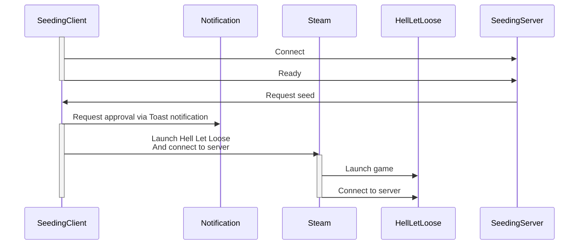

# Hell Let Loose Seeding Client
  

Client to automatically start Hell Let Loose and connect to a server when seeding is requested.

## Requirements
- Windows
- Steam
    - Hell Let Loose in your steam library

## How to use
- Download the zip from the latest release here: https://github.com/NanoBob/HellLetLooseSeedingClient/releases/latest
- Unzip the downloaded file
- Run the .exe file from the unzipped directory

## How it works
The seeding client will register itself with a central server, and indicate its readiness to seed.  
When seeding is requested, this server sends a request to all connected clients.  

Every client can then choose to start seeding, or decline it based on a Windows toast notification. If the notification is ignored for 60 seconds the game will launch and connect to the server.

The only thing that is ever sent to the central server is:
- Whether or not the game is running
- The current status of the game (ready, booting, running)
- Whether or not the user rejected the seed request

No user identifiable data is sent to the central server.

## Technical details
The application is a dotnet 10 application, with no visuals (no console or GUI).  
The application runs completely in the background, and will continuously try to connect to a websocket server based on a url defined in an appsettings file. (Or environment variables, or commandline arguments)  

Once connected the client sends a couple updates to the server about its current state, this would be:
- Ready (ready to run game)
- Running (game is already running)

Once a request is made to the game, and the toast is not declined, the game uses the steam executable to request for the game to be started, using commandline arguments to connect to the IP and port provided by the websocket server.  

It then injects two mouse button clicks into the game, one to skip the intro animations, the other to trigger the game to start connecting to the server.