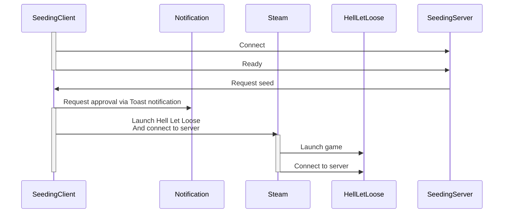

# Hell Let Loose Seeding Client
  

Client to automatically start Hell Let Loose and connect to a server when seeding is requested.  
When seeding is requested you will receive a Windows notification allowing you to either start seeding, or refuse to join. If you ignore the notification altogether it will boot the game to start seeding after 60 seconds.

## Requirements
- Windows
- Steam
    - Hell Let Loose in your steam library

## How to use
- Download the zip from the latest release here: https://github.com/NanoBob/HellLetLooseSeedingClient/releases/latest
- Unzip the downloaded file
- Run the .exe file from the unzipped directory
- Enable auto-start either via the notification, or via the system tray, more info below.  

### System tray
When the application is running, there should be an icon for it in your Windows System Tray.  
The system tray icon allows you to:
- Enable auto-start (start automatically when Windows starts)
- Disable auto-start
- Exit the application

### Autostart
When you start the application with auto-start disabled it will prompt you via a toast notification to enable auto-start.  
If you don't see this, ensure you are not in do-not-disturb mode.  

Alternatively you can enable autostart with the system tray icon.

### Uninstall
In order to stop using the application simply:
- Disable auto-start via the system tray icon.
- Exit the application via the system tray icon.
- You can now delete the downloaded files if you wish.

### Troubleshooting
- **I get a "Windows Protected your PC" screen**  
  This is expected. When a new (version of a) application is published by an unknown publisher, [Microsoft Defender SmartScreen](https://learn.microsoft.com/en-us/windows/security/operating-system-security/virus-and-threat-protection/microsoft-defender-smartscreen/) by default distrusts it. Once an application is used more this stops appearing.  

  In order to bypass this, click the "More info" link in the SmartScreen popup window, and then click "Run anyway".
- **Can I trust this?**  
  It is always wise to be skeptical when running any executable from an unknown source on your system.  
  This application however does nothing malicious, and can be trusted. Additionally it is developed open-source, meaning anyone can read the code of the application itself and validate what it does.

  Some more (technical) details on the inner workings are also explained in this readme.    
- **I want more time to dismiss the notification**
  - Open the appsettings.json file in the unzipped folder
  - Change the `notificationDuration` to be longer.
- **I get too many notifications**
  - Open the appsettings.json file in the unzipped folder
  - Change the `rejectionDuration` to be longer. This impacts how long it takes before you can receive a second notification after rejection.
- **My game starts, but is stuck in the menu**  
  - Open the appsettings.json file in the unzipped folder
  - Change the `FirstClickDelay` and `SecondClickDelay` to be longer. (for example `00:00:25.0` for 25 seconds)
  - Restart your PC, or manually kill the `HellLetLooseSeedingClient` process through task manager, and restart it by running the downloaded .exe manually.
- **My game started without first showing me a notification**
  - Make sure your Windows Notifications aren't set to do-not-disturb.

## How it works
The seeding client will register itself with a central server, and indicate its readiness to seed.  
When seeding is requested, this server sends a request to all connected clients.  

Every client can then choose to start seeding, or decline it based on a Windows toast notification. If the notification is ignored for 60 seconds the game will launch and connect to the server.

The only thing that is ever sent to the central server is:
- Whether or not the game is running
- The current status of the game (ready, booting, running)
- Whether or not the user rejected the seed request

No user identifiable data is sent to the central server.

## Technical details
The application is a dotnet 10 application, with no visuals (no console or GUI).  
The application runs completely in the background, and will continuously try to connect to a websocket server based on a url defined in an appsettings file. (Or environment variables, or commandline arguments)  

Once connected the client sends a couple updates to the server about its current state, this would be:
- Ready (ready to run game)
- Running (game is already running)

Once a request is made to the game, and the toast is not declined, the game uses the steam executable to request for the game to be started, using commandline arguments to connect to the IP and port provided by the websocket server.  

It then injects two mouse button clicks into the game, one to skip the intro animations, the other to trigger the game to start connecting to the server.
